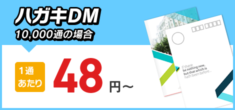
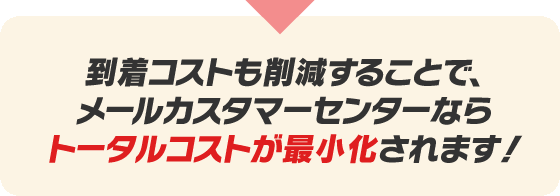

<!DOCTYPE html>
<html lang="Ja">
<meta charset="utf-8">
   <link rel="stylesheet" href="lp.css">

	<!-- ビューポートの設定 -->
   <meta name="viewport" content="width=device-width,initial-scale=1">
<title>
   LPサイト   
</title>

<body>

   <!--header-->
   

      

         
ダイレクトメール業界最安値に挑戦！

         
メールカスタマーセンター株式会社
       

      

         
      

      

         
         
      

      <!--header-form-sp-->
      

         
         
      

   

   <!--メニュー-->
   

      
      
      
      
   

   
   <!--sec1-->

   

      

         
         
      

      

         
         
      

         <!--sec1-1 sp-->
         

            
            
         

      

         
         
         
      

         <!--sec1-2 sp-->
         

            
            
            
            
         

   

      

      

         
         
         
         
         
         
      

      

         <!--sec1-3 sp-->
         

         

            
            
            
            
            
            
         

         

   <!--sec2-->
   

      
         <!--cont2_sp-->
         

      

         
            
         
            
         
            
      

      
         <!--sp-->
         
   

   

      <!--sec2-reason-->
      

         
         
            
         

            
             
               

                  

                     複数のお客様の発送物を弊社が差出人となる事で、配送クオリティ（到着率）の高い日本郵便『ゆうメール』や、ヤマト運輸『クロネコDM便』の、大口割引適用を受けております。
                      適用された大口割引を還元することにより、お客様の『発送コスト削減』のお手伝いをさせて頂いております。
                  

                    
               

               
                       
            

            
            

               
               

               

               

                  DMの到着コストという視点で考えますと、一番の原因は不着物です。不着の理由は、いくつか考えられますが中でも一番多いのは、『宛先不明』による不着です。これは、顧客が引越しをしたのだが引越し先の住所が更新されていない事が原因と考えられます。
                   都市部での転居率は15％近く、1年経過後には15％以上のデータが不着物候補となりえます。（日本郵便資料）
                   そこで私共は『電話使用状況調査システム』を使用し、不着候補データを抽出・送付先データから除去する事で『到着コスト削減』をご提案させて頂きます。
               

               
                  
               

                 
                  
            

      

      

         
         
         
         
         
      

   

   <!--sec3-->
   

      
      

      
      
      
      
   

   <!--sec3-reason-->
   

      

         
         

         <!--提案１-->
         
         
         
         

              
            

               弊社は年間２億通、700社様とお取引をさせて頂き、業界最大級の取扱規模を保有しています。その経験と、日本郵便（株）・ヤマト運輸（株）との強固な連携体制を生かし、お客様のコストを最小化いたします。
                大手のお客様から小口のお客様まで、札幌・東京・新潟・名古屋・大阪・福岡の各営業所に所属する熟練スタッフが、お客様の経営戦略に沿った最適プランをご提案致します。
            

             
         
  

         <!--提案２-->
           
         
         
         

            
            

               　印刷物（チラシ・パンフレット、冊子、封筒など）の印刷から発送まで、全てをワンストップでご依頼いただいた際も、トータルコストを最小化致します。
                A4両面カラー８P冊子2000部が100円以下、A4両面カラーチラシ１枚1000部が80円以下で、印刷から発送まで可能です。
            

               
         
  
            
         <!--提案３-->
           
           

         

            
            

               小ロットの印刷、封入作業、資材管理など、DMに関わることならなんでもお気軽にご相談下さい！　弊社の知見を生かし、どのパートでもトータルでサポートいたします。
            

               
         
              
      

   

   <!--お客様の声-->
　 

   

   

        
      
      
      
   

   

      
      
      
   

   

   <!--よくある質問、サービスの流れ-->
   

      

         
         

         
         
      

      

         
         

         

            
            
            
         

         

            

            
            
まずはお問合せフォーム、もしくはお電話にてご連絡下さい。
                最寄りの支店担当者より折返しご連絡致します。（札幌・東京・新潟・名古屋・大阪・福岡）
            

         

            
         

            
            
お客様の状況（送付物形状、日程など）をお打合せさせて頂き、
                貴社に最適なプランをご提案させて頂きます。
            

         

            
         

            
            
最適なプランで記者のコスト削減に、継続的に貢献させて頂きます。

            

         

      

   

   

      
      

      
      
      
      
   

   <!--footer-->
   

      copyright(c) 2013 mail customer center Co.,Ltd. All Right Reserved.
   

</body>
</html>
